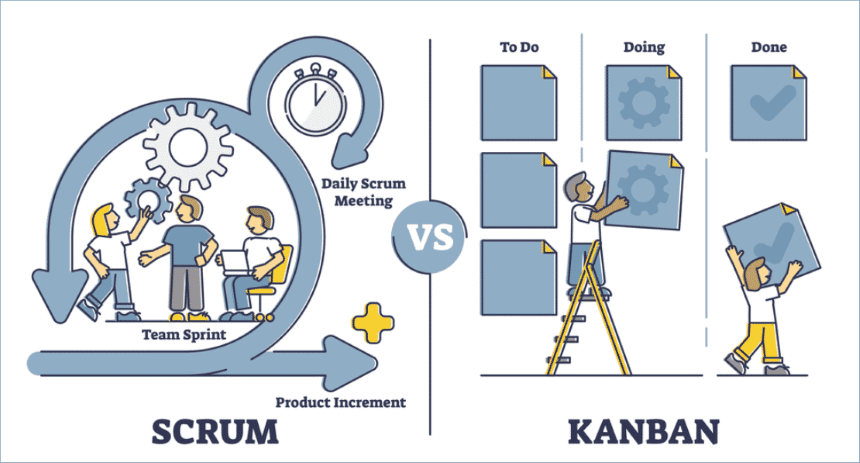
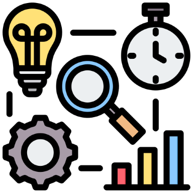

# Projektmanagement-Methode

## Kanban
Das **Kanban-System** ist eine agile Arbeitsmethode aus dem Projektmanagement, welche dabei hilft, die Zusammenarbeit von Teams zu verbessern. Durch die Visualisierung von Arbeitsprozessen können diese verwaltet und verbessert, sowie deren Effizienz und Qualität gesteigert werden. Die Arbeitsschritte werden dabei (digital) einzeln auf Tafeln dargestellt und in Verantwortlichkeiten unterteilt, sodass selbst komplexe Projekte für alle Beteiligten übersichtlich und leicht verständlich gemacht werden.

Das Kanban-System ermöglicht es durch seine Struktur zudem, konsistente Arbeitsabläufe zu gewährleisten, auf die sich Mitarbeiter und weitere am Projekt Beteiligte besser einstellen und so etwa besser Ressourcen einplanen können. Da das System kontinuierlich mit dem aktuellen Entwicklungsstand abgeglichen wird, ist auch eine ständige Verbesserung möglich, da Schwachstellen so leicht bemerkbar werden.
Kanban kann auch sehr gut für kleine Projekte, an welchen nur eine Person arbeitet, verwendet werden.

[Quelle](../Quellverzeichnis/index.md#kanban)
## Scrum
**Scrum** ist ein Framework für eine bestimmte Art des Projektmanagements. Es zeichnet sich durch schlanke Prozesse, schrittweise Entwicklung und regelmäßige Feedbackschleifen aus. Ursprünglich wurde es vor allem in der Softwareentwicklung eingesetzt, mittlerweile findet es aber in vielen weiteren Branchen Anwendung.

Scrum verfolgt einen inkrementellen und iterativen Ansatz. In aufeinanderfolgenden, eigenständigen Phasen, den sogenannten Sprints, werden verschiedene Versionen eines Produkts entwickelt. Diese Sprints werden kontinuierlich wiederholt, bis ein zufriedenstellendes und vollständiges Produkt erreicht ist.

[Quelle](../Quellverzeichnis/index.md#scrum)
## Kanban und Scrum in dieser Semesterarbeit

In meiner Semesterarbeit werde ich mit Kanban und Scrum arbeiten. 
Weshalb gleich mit beiden Methoden?
Kanban ist in Github bereits integriert, in welchen man Boards und Tasks selbst erstellen kann. Zusätzlich kann ich verschiedene Ansichten erstellen, wie beispielsweise eine Gant-Projektübersicht, etc. 
Zusätzlich verwende ich die Sprints, welche in Scrum integriert sind. Da ich jedoch alleine bin, habe ich bei mir nur 3 Sprintgespräche eingeplant. Dies, weil die Daily Sprints wegfallen, da ich die Semesterarbeit als Einzelarbeit mache, somit bin ich Zeitgleich auch der Scrum-Master. 

Dies ist der Link zu meinem Projektmanagement:
<a href="https://github.com/users/Radball-Migi/projects/3/views/4" target="_blank">Roadmap · HF ITCNE24 - 2 Semarbeit BPMN</a>

[Quelle](../Quellverzeichnis/index.md#kanban-und-scrum)

## Six Sigma

Six Sigma ist eine Methode zur Prozessverbesserung, die Unternehmen dabei unterstützt, ihre Geschäftsprozesse zu optimieren. Ziel ist es, einheitliche Abläufe einzuführen, um Abweichungen im Endprodukt zu minimieren und somit die Anzahl der Produktfehler zu reduzieren.

Im Kern basiert Six Sigma auf der Annahme der DMAIC-Methode:

**Define (Definieren)**
In dieser Phase wird das Problem klar definiert. Es werden die Ziele des Projekts festgelegt, der Umfang bestimmt und die Kundenanforderungen identifiziert.

**Measure (Messen)**
Hier werden die aktuellen Prozesse gemessen, um eine Basislinie zu erstellen. Es werden Daten gesammelt, um den Ist-Zustand zu verstehen und die Leistung zu bewerten.
   
**Analyze (Analysieren)**
In dieser Phase werden die gesammelten Daten analysiert, um die Ursachen von Problemen und Variationen zu identifizieren. Es wird untersucht, welche Faktoren die Prozessleistung beeinflussen.

**Improve (Verbessern)**
Basierend auf den Analyseergebnissen werden Lösungen entwickelt und implementiert, um die identifizierten Probleme zu beheben. Ziel ist es, die Prozessleistung zu verbessern und die Variationen zu reduzieren.

**Control (Kontrollieren)**
In der letzten Phase werden die Verbesserungen überwacht und kontrolliert, um sicherzustellen, dass die erzielten Verbesserungen nachhaltig sind. Es werden Kontrollmechanismen eingeführt, um die Prozessleistung langfristig zu sichern.

Laut Six Sigma benötigen alle Prozesse Inputs und Outputs. 
**Inputs** sind die Aktionen, die dein Team durchführt, während **Outputs** die Ergebnisse dieser Aktionen darstellen. 
Grundsätzlich gilt: Je mehr Inputs (oder Aktionen) kontrolliert werden können, desto besser lassen sich auch die Outputs steuern.

[Quelle](../Quellverzeichnis/index.md#six-sigma)
