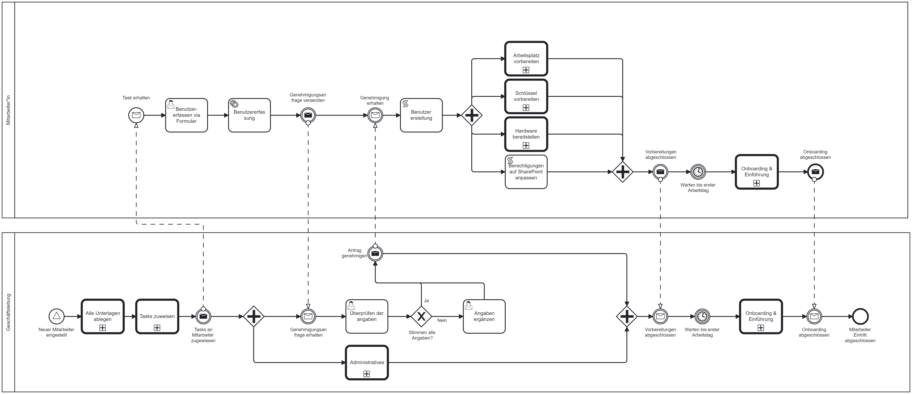
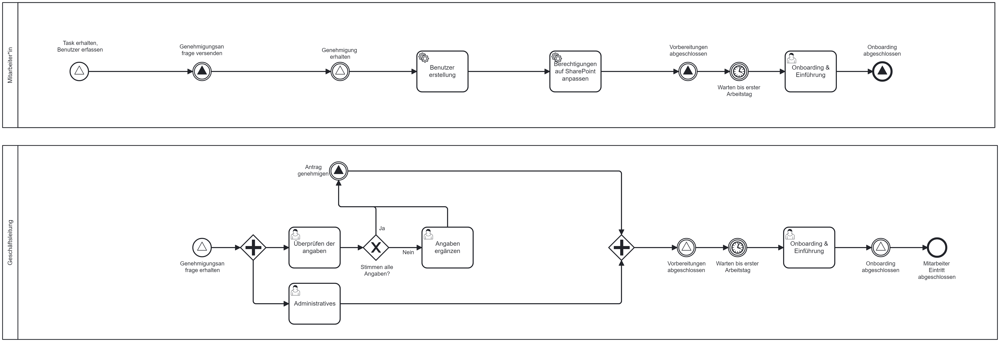
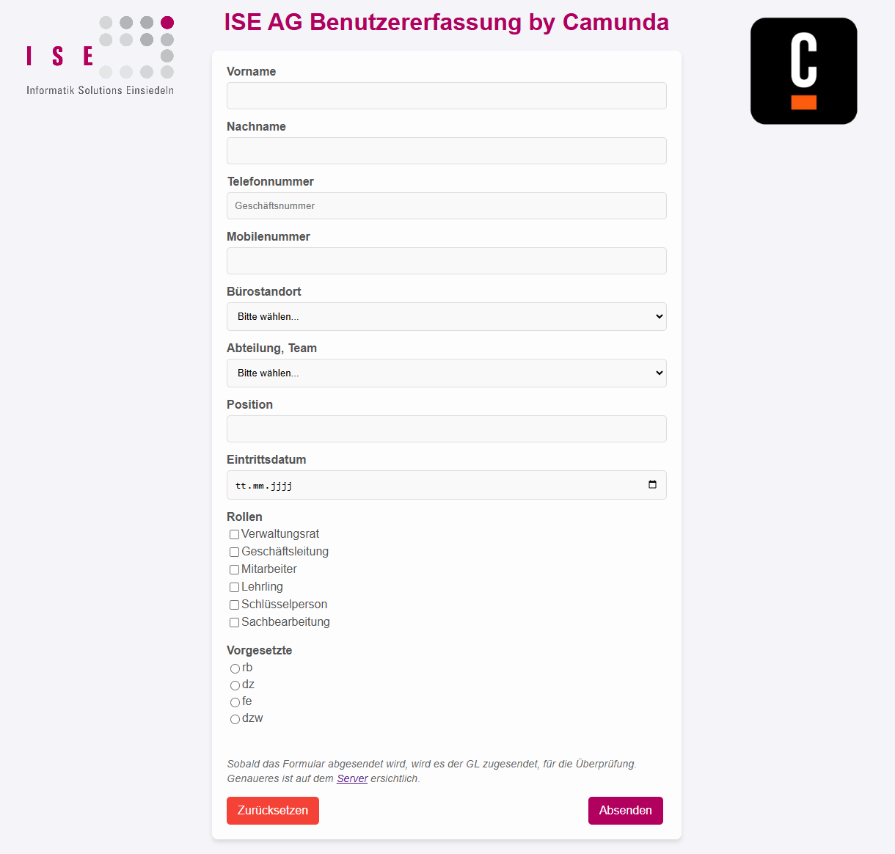

#  Verbessern (Improve) Phase

Die Improve-Phase ist der vierte Schritt in einem Six Sigma Projekt. In dieser Phase werden die in der [Analyze-Phase](./33_analysieren.md) identifizierten Hauptursachen für Prozessabweichungen adressiert und Lösungen entwickelt, um diese zu beheben. Ziel ist es, durch gezielte Verbesserungsmassnahmen die Prozessleistung zu optimieren und die identifizierten Probleme nachhaltig zu lösen. Dies umfasst die Anwendung von Kreativitätstechniken, statistischen Methoden und Pilotprojekten, um die Wirksamkeit der vorgeschlagenen Lösungen zu testen und zu validieren.

[Quelle](../Quellverzeichnis/index.md#improve-phase)

## Was ist Camunda?

[Quelle](../Quellverzeichnis/index.md#camunda-logo)

Camunda ist eine leistungsstarke Softwareplattform, die Unternehmen dabei unterstützt, ihre Geschäftsprozesse effizient zu steuern. Sie bietet umfassende Funktionen für das Business Process Management (BPM) und die Automatisierung von Workflows.

Im Bereich BPM ermöglicht Camunda die Modellierung, Ausführung und Überwachung von Geschäftsprozessen. Ziel ist es, Geschäftsabläufe systematisch zu analysieren und zu optimieren, um die Effizienz und Effektivität der Organisation zu steigern.

Ein herausragendes Merkmal von Camunda ist die Fähigkeit zur Automatisierung von Workflows. Unternehmen können spezifische Regeln und Bedingungen festlegen, um Geschäftsprozesse automatisch ablaufen zu lassen. Dies reduziert menschliche Fehler und sorgt für konsistente Abläufe.

Zusätzlich bietet die Plattform Werkzeuge zur visuellen Modellierung von Prozessen. Dies ermöglicht den Benutzern, einen klaren Überblick über die Struktur und den Ablauf von Aufgaben innerhalb des Unternehmens zu erhalten. Diese Modelle dienen als Grundlage für die Implementierung automatisierter Workflows.

Insgesamt hilft Camunda Unternehmen dabei, ihre Geschäftsprozesse effizienter zu gestalten und eine bessere Kontrolle über ihre Abläufe zu erlangen.

## Umsetzung (Improve)

Ich konnte die Checkliste erfolgreich durch ein Camunda-BPMN ersetzen. Ich habe alle analysierten Probleme erkannt und behoben. Das ganze habe ich mit dem Camunda Modeler umgesetzt.

Das _Know-how_ habe ich mir durch meine aktive Teilnahme am BPM-Unterricht bei Thomas Kälin sowie durch das Studium des Praxishandbuchs angeeignet:
*BPMN von Jabok Freund und Bernd Rücker - Mit Einführung in DMN, 6. Auflage*
[Praxishandbuch BPMN](https://www.hanser-elibrary.com/doi/epdf/10.3139/9783446461123.fm)

Unter der Nachfolgender Grafik, zeige ich auf, wie der *Personaleintrittsprozess* logisch aussehen würde. 

Falls dieses Bild ungenau oder zu klein angezeigt wird ist [hier](../../ressources/images/personaleintrittsprozess_total.svg) die SVG-Datei verlinkt.

Weshalb ein logischer Prozess?
Wie ich erkennen konnte, musste ich für den Camunda Prozess einige Anpassungen machen, welche aus der logischen Sicht nicht Nachvollziehbar waren. 
Dies ist nun der technische Prozess:

Falls dieses Bild ungenau oder zu klein angezeigt wird ist [hier](../../ressources/images/personaleintrittsprozess_tecnical.svg) die SVG-Datei verlinkt.

### Vergleich beider Prozesse
Wenn man beide Prozesse vergleich, gibt es bei den itermediate-Events einen unterschied zwischen beidenProzessen. 
Logischerweise würde der Prozess mit Messages ausgestattet sein. 
Bei den Tests wurden mir im technischen Prozess die Token jedes Mal bei einem Catch-Event gestoppt.
Als ich dieses Verhalten gegoogelt habe, berichteten einige Nutzer, dass sie auch diese Problem hatten und deshalb auf Signale umgestiegen sind, weshalb ich das auch gemacht habe. 

"BSP Forum verlinken"

### Call-Activities

Vorab als Erklärung, die fett umrandeten Tasks werden als Aufruf-Aktivitäten oder Call-Activities bezeichnet. Sie stehen für global definierte Prozesse oder Aufgaben, die im aktuellen Prozess eingebunden sind.

Diese Methode wurde gewählt, da die detaillierte Beschreibung dieser Prozesse den Rahmen der Semesterarbeit überschreiten würde.

### Formular

Ursprünglich habe ich im Einreichungsformular erwähnt, dass ich ein Camunda Formular Verwenden werde. Während der Einrichtung des Forms, ist mir aufgefallen, dass beim Eintrittsdatum, das Datum jedes Mal leer bleibt bei der Übermittlung. 
Auch bereits im Gespräch mit Thomas fiel uns dieses Problem auf und auf die Schnelle haben wir keine Lösung gefunden. Ich habe mich daraufhin entschieden, eine alternative Lösung zu suchen. 
Anstelle eines Camunda Formulars, habe ich nun ein HTML Formular, mit dem ich beim Absenden eine Prozessinstanz starte und Zeitgleich alle Werte mitliefere. 

Bild Noch genauer machen, damit alles sichtbar ist. 

Das HTML-File kann [hier](../../ressources/scripts/Webform.html) eingesehen werden.

Formular beschreiben und verlinken

