#  Kontrollieren (Control) Phase

Die Control-Phase ist der fünfte und letzte Schritt in einem Six Sigma Projekt. In dieser Phase werden die in der Improve-Phase implementierten Lösungen überwacht und kontrolliert, um sicherzustellen, dass die Verbesserungen nachhaltig sind und die Prozessleistung stabil bleibt. Ziel ist es, die erzielten Verbesserungen zu standardisieren und in den täglichen Betrieb zu integrieren.


[Quelle](../Quellverzeichnis/index.md#control-phase) 


Die **Control-Phase** erstreckt sich über einen längeren Zeitraum und hat das Ziel, den angepassten Prozess kontinuierlich auf seine Nachhaltigkeit und mögliche Optimierungspotenziale zu prüfen. In dieser Phase wird sichergestellt, dass der implementierte Prozess stabil läuft und langfristig die gewünschten Ergebnisse liefert.

Allerdings wird es noch eine Weile dauern, bis Camunda den derzeitigen Personaleintrittsprozess der ISEAG vollständig ersetzen kann. Da die Semesterarbeit zeitlich begrenzt ist, habe ich nicht die Möglichkeit, umfassende Langzeitstudien zu meinem Prozess durchzuführen oder dessen langfristige Auswirkungen zu dokumentieren.

Trotzdem habe ich bereits während der [**Improve-Phase**](./34_verbessern.md) kontinuierlich Tests durchgeführt, um sicherzustellen, dass der Prozess in Camunda reibungslos läuft, korrekt durchlaufen wird und erfolgreich abgeschlossen werden kann. Diese Tests bieten zwar keine langfristige Perspektive, bestätigen jedoch die grundsätzliche Funktionalität und Stabilität der neuen Lösung.

## Testing

Für das Testing habe ich verschiedene Szenarien durchgespielt, die in der Praxis auftreten könnten, um die Funktionsfähigkeit des Prozesses sicherzustellen. 
Um das Testing grob zusammen zufassen, habe ich untenstehend eine Tabelle für das Testing erstellt. Mit einer Testingtabelle:

### Testmatrix

| **Test-ID** | **Was wird getestet?**                                          | **Zweck / Ziel**                                                                                                                  | **Erwartetes Ergebnis**                                                               | **Effektives Ergebnis** | **Dokumentation / Link**          |
| ----------- | --------------------------------------------------------------- | --------------------------------------------------------------------------------------------------------------------------------- | ------------------------------------------------------------------------------------- | ----------------------- | --------------------------------- |
| T01         | Erfassung neuer Mitarbeiter via HTML-Formular                   | Wird beim Absenden  des Forms alles via API mit gesendet                                                                          | Beim absenden des Formulars erscheint die Meldung erfolgreich                         |                         | [Dokumentation](#)                |
| T02         | Datenübertragung und Start der Prozessinstanz                   | Prozessinstanz wird gestartet und die Daten aus dem Formular an den Prozess übergeben                                             | Prozessinstanz wird gestartet und Variablen sind sichtbar in den Tasks                |                         | [Dokumentation](#)                |
| T03         | Übernahme der Tasks und Bestätigung des Genehmigungsantrags     | Taskübernahme und Exckusive Gateway funktioniert                                                                                  | Task kann übernommen und bearbeitet werden.<br>Nach annahme wird das Signal versendet |                         | [Dokumentation](#)                |
| T04         | Benutzer erstellung wird gestartet und läuft erfolgreich durch. | Benutzer wird erstellt, mit Department und Managerzuweisung.<br>Zusätzlich wird der Benutzer auch in die Lizenzgruppe hinzugefügt | Benutzer wird erstellt, in den Properties sind auch Department und Manager zugewiesen |                         | [Dokumentation](#)                |
| T05         | Gruppenzuweisung via Script                                     | Zuvor erstellter Benutzer wird den Entra-ID-Gruppen hinzugefügt, anhand der Rollenzuweisung.                                      | Benutzer wird in die Entra-ID-Gruppen hinzugefügt                                     |                         | [Dokumentation](#)                |
| T06         | Time intermidiate Event                                         | Der Zwischenevent triggert erst wenn das Datum erreicht wird, welches zuvor im Formular eingegeben wurde.                         | Datumsvalue ist im Event drin.                                                        |                         |                                   |
| T07         | Logs                                                            | Werden die Logs im besagten Pfad erstellt?                                                                                        | Logs werden im Pfad `C:\temp\PErsonaleintritt` erstellt                               |                         | [Logs](#logs)                     |
| T08         | Camunda Server                                                  | Existiert und funktioniert der Container                                                                                          | Ist der Container vorhanden und läuft dieser auch.                                    |                         | [Camunda Server](#camunda-server) |

**Hinweise**
- **Test-ID:** Eine eindeutige Kennung, um die Tests zu identifizieren und sie einfacher referenzieren zu können.
- **Dokumentation / Link:** Verlinkt direkt zur Dokumentation, spezifischen BPMN-Diagrammen oder zugehörigen Bereichen im Repository.
- Diese Matrix soll sicherstellen, dass alle relevanten Bereiche des Personalprozesses systematisch getestet und dokumentiert werden.


### Camunda

Mithilfe von Camunda konnte ich die BPMN Prozesse aufzeichnen, technisch nutzen und mittels Server eine vollfunktionsfähige Lösung bereitstellen. 

Mithilfe des Camunda Cockpits konnte ich den Status der Prozessinstanzen grafisch nachverfolgen. Dieses Tool ermöglicht es, den Ablauf im Detail zu überprüfen und sicherzustellen, dass sich der Prozess an der richtigen Stelle im Workflow befindet.

#### **Camunda Server**
Den Camunda Server habe ich aktuell auf einem Docker Container, auf meinem Lokalen Notebook am Laufen. 
Für den ersten Moment ist dies in Ordnung, jedoch ist dies ausbaufähig, damit dieser in Zukunft auch auf Azure laufen würde. 

Der Camunda-Server wurde anhand einem Image erstellt, welches wir auch bereits im Unterricht verwendet haben. mit der bereits eingerichteten API, habe ich ein Image erstellt, welches ich dann für die Semesterarbeit verwenden konnte.

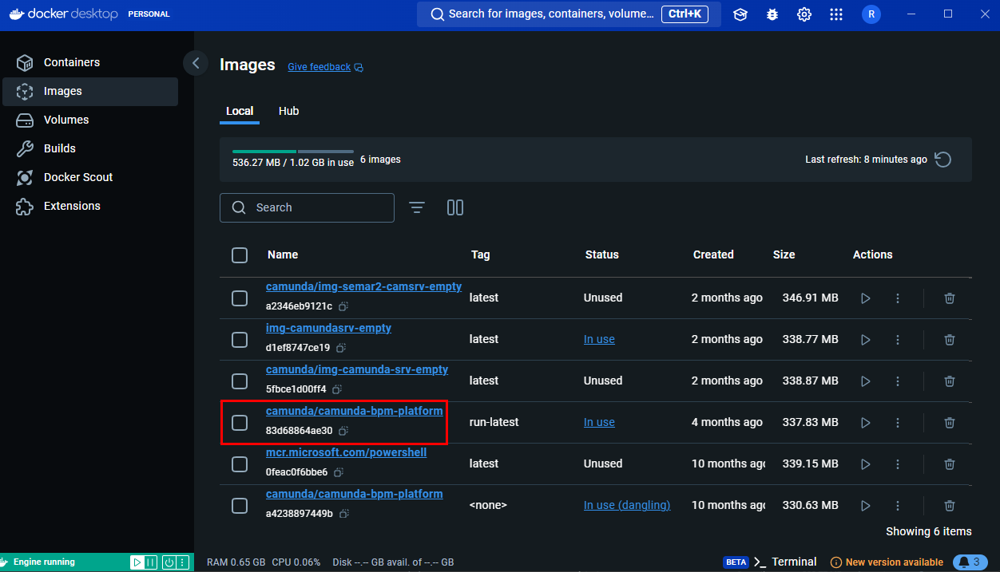
*Images on Docker Desktop*

Mit diesem Image und nachfolgenden Befehl, können wir innerhalb von 10-15 Sekunden einen neuen Container erstellen. 

```Terminal
docker run -d --name ITCNE-SEMAR2-CAMSRV -p 8080:8080 camunda/camunda-bpm-platform:run-latest
```

So entsteht dann dieser Container.

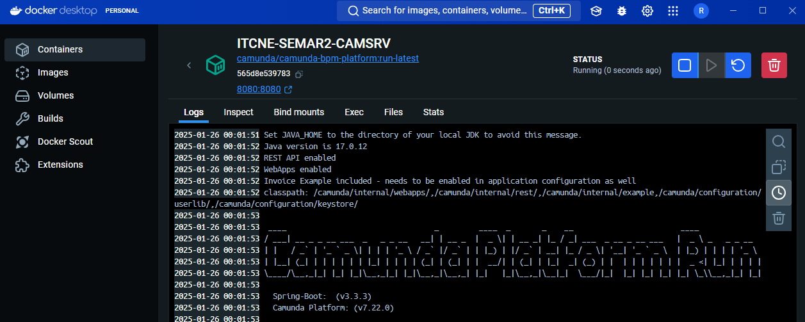
*Camunda Container on Docker Desktop*


#### **Formular**

Das Formular wurde während der Arbeit von einem Camunda Form zu einem HTML Form umgeschrieben, da es Probleme gab, mit dem Datumsfeld, welches erst kurz vor Arbeitsabgabe gelösst werden konnte. 
Da mitlerweile das HTML sehr gut funktionierte, bin ich bei diesem Geblieben. 

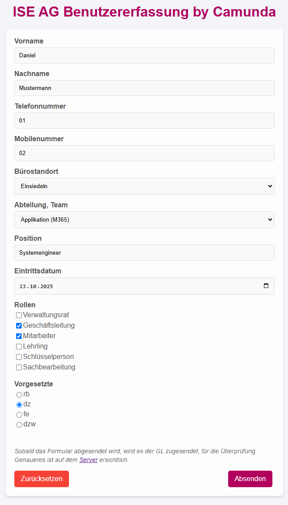
*Ausgefülltes Formular*

#### **Camunda BPMN Diagramm**

Die BPMN-Diagramme habe ich bereits in der [Improve Phase](./34_verbessern.md#Umsetzung-(Improve)) erläutert und können auch dort eingesehen werden.


#### **Camunda Prozess**


### Scripts

Die Scripts wurden mit PowerShell geschrieben und enthalten teilweise auch Python ausschnitte. 
Beim Script wurde alles kommentiert, damit jeder versteht, für was, was steht. 
Wie bereits in der [Improve Phase](./34_verbessern.md) erwähnt, werden die Skripte derzeit lokal auf dem Notebook ausgeführt, da es Probleme mit der Zertifikatsanmeldung am Camunda-Server gab. Um keine unnötige Zeit mit der Behebung dieses Problems zu verlieren, habe ich mich entschieden, die Skripte vorerst lokal zu starten. Sobald die Zertifikatsanmeldung gelöst ist, werde ich die Skripte entsprechend integrieren und anpassen.

Das entsprechende Script kann unter folgendem Link eingesehen werden:
- [MgGraph_User_Creation.ps1](https://github.com/Radball-Migi/HF-ITCNE24-SemArbeit2-BPMN-Personalprozess/blob/main/ressources/scripts/MgGraph_User_Creation.ps1)
- [MgGraph_SP_adjust_permissions.ps1](https://github.com/Radball-Migi/HF-ITCNE24-SemArbeit2-BPMN-Personalprozess/blob/main/ressources/scripts/MgGraph_SP_adjust_permissions.ps1)


### Logs

Damit wir die Fehler im System während dem Betrieb erkennen können, haben wir während der Asuführung ein Log, welches erstellt wird. 
Der Speicherort ist ein Ordner, im `C:\temp`. 
Die Files lauten:
- `.\Personaleintritt\logs\user_creation-[Aktuelles Datum].log` 
- `.\Personaleintritt\logs\sp_rights_customize-[Aktuelles Datum].log`

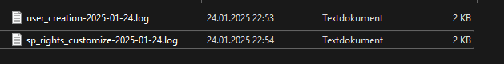
*Log-Ablage*

Die Logs sehen folgendermassen aus:

```Text
********************************************
MGGraph_User_Creation.ps1    -    2025-01-24
********************************************

2025-01-24 22:50:53: Starte FetchAndLock von Tasks...
2025-01-24 22:50:53: FetchAndLock abgeschlossen.
2025-01-24 22:50:53: Verarbeite Task ID: 90c4c2f8-da99-11ef-9510-0242ac110002
2025-01-24 22:50:53: Hole Benutzerinformationen von Camunda...
2025-01-24 22:50:53: Importiere Login-Informationen...
2025-01-24 22:50:53: Login-Informationen von Local importieren
2025-01-24 22:50:53: Login-Informationen erfolgreich importiert.
2025-01-24 22:50:53: Verbindung mit Microsoft Graph wird hergestellt...
2025-01-24 22:50:53: Verbindung mit Microsoft Graph erfolgreich
2025-01-24 22:50:53: Erstelle neuen Benutzer...
2025-01-24 22:50:53: Prüfe UPN...
2025-01-24 22:50:53: UPN gefunden: Daniel.Mustermann1@iseschool2013.onmicrosoft.com
2025-01-24 22:50:53: Erstelle neues Passwort...
2025-01-24 22:50:53: Generiere Passwort...
2025-01-24 22:50:53: Passwort erfolgreich generiert.
2025-01-24 22:50:53: Evaluiere Department
2025-01-24 22:50:53: Benutzer Mustermann, Daniel mit UPN Daniel.Mustermann1@iseschool2013.onmicrosoft.com erfolgreich erstellt.
2025-01-24 22:50:53: Warte 3 Minuten...
2025-01-24 22:53:53: Setze Manager...
2025-01-24 22:53:53: Evaluiere Manager
2025-01-24 22:53:54: Manager gefunden
2025-01-24 22:53:54: Manager erfolgreich gesetzt
2025-01-24 22:53:54: Schliesse Task ID: 90c4c2f8-da99-11ef-9510-0242ac110002 ab...
2025-01-24 22:53:54: Task ID: 90c4c2f8-da99-11ef-9510-0242ac110002 erfolgreich abgeschlossen.
2025-01-24 22:53:54: Task ID: 90c4c2f8-da99-11ef-9510-0242ac110002 abgeschlossen.
2025-01-24 22:53:54: Starte FetchAndLock von Tasks...
2025-01-24 22:53:54: FetchAndLock abgeschlossen.
2025-01-24 22:53:54: Keine Tasks gefunden. Warte...
```
*Benutzererstellung*

```Text
****************************************************
MgGraph_SP_adjust_permissions.ps1    -    2025-01-24
****************************************************

2025-01-24 22:54:53: Starte FetchAndLock von Tasks...
2025-01-24 22:54:53: FetchAndLock abgeschlossen.
2025-01-24 22:54:53: Verarbeite Task ID: b44a17eb-da9d-11ef-9510-0242ac110002
2025-01-24 22:54:53: Hole Benutzerinformationen von Camunda...
2025-01-24 22:54:53: Importiere Login-Informationen...
2025-01-24 22:54:53: Login-Informationen von Local importieren
2025-01-24 22:54:53: Login-Informationen erfolgreich importiert.
2025-01-24 22:54:53: Verbindung mit Microsoft Graph wird hergestellt...
2025-01-24 22:54:53: Setze Rechte für Rolle: gl
2025-01-24 22:54:53: Rechte für gl gesetzt.
2025-01-24 22:54:53: Setze Rechte für Rolle: ma
2025-01-24 22:54:53: Rechte für ma gesetzt.
2025-01-24 22:54:53: Schließe Task ID: b44a17eb-da9d-11ef-9510-0242ac110002 ab...
2025-01-24 22:54:53: Task ID: b44a17eb-da9d-11ef-9510-0242ac110002 erfolgreich abgeschlossen.
2025-01-24 22:54:53: Task ID: b44a17eb-da9d-11ef-9510-0242ac110002 abgeschlossen.
2025-01-24 22:54:53: Starte FetchAndLock von Tasks...
2025-01-24 22:54:53: FetchAndLock abgeschlossen.
2025-01-24 22:54:53: Keine Tasks gefunden. Warte...
```
*SharePoint-Zugriffsrechte vergeben*

Zeitgleich wenn das Script ausgeführt wird, wird das Log auch im Terminal angezeigt. 

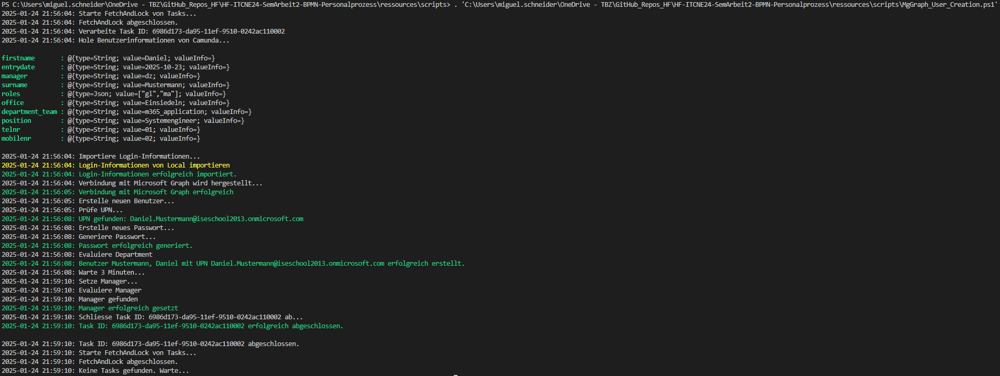
*Output Script "MgGraph_User_Creation.ps1"*

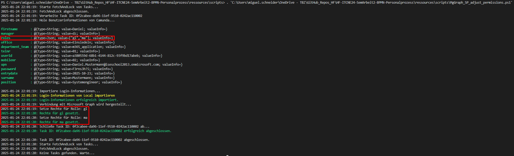
*Output Script "MgGraph_SP_adjust_permissions.ps1"*


### SharePoint

Im SharePoint habe ich einigermassen ein Test Portal erstellt, welches und veranschaulichen soll, wie die Berechtigungen gesetzt werden. 
Aus Sicherheitsgründen ist der Zugriff auf diesen SharePoint eingeschränkt und kann nur von mir genuzt werden. 
An der Schlusspräsentation wird diesser ausschliesslich geziegt. 
Grund dafür ist dass nur ich ein Login dafür habe und der SharePoint nach drausen geschützt ist. 

Nichts desto trotz Zeige ich in diesem Abschnitt auf, wie die Berechtigungen auf dem SharePoint greifen. 

Wir haben auf dem SharePoint mehrere Berechtigungsgrppen, welche wie Script und Rollenzuweisung dem Benutzer hinzugefügt werden. 
Anhand der jeweiligen Rolle, erhällt der Benutzer andere Berechtigungen. 
Auf dem SharePoint gibt es insgesammt 5 Berechtigungen
- Vollzugriff
- Editor
- Bearbeiten
- Mitwirken 
- Lesen

Vorallem wird der Vollzugriff, Bearbeiten, Mitwirken und Lesen verwendet.
Der Unterschied zwischen Bearbeiten und Mitwirken ist, dass unter Mitwirken die Benutzer Listen oder Bibliotheken nicht auf einer Site Löschen können. 

Um dies etwas verständlicher darzustellen, habe ich hier zwei Beispielesüberischten beigefügt, bei denne Sie die Berechtigungen auf der Site und auf einem Newsbeitrag sehen können. 
Weiter unten stehen dann zwei Benutzer mit den Jeweils zugewiesenen Rollen. 

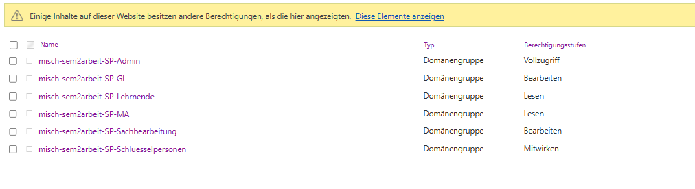
*Berechtigungen auf der SharePoint Site*

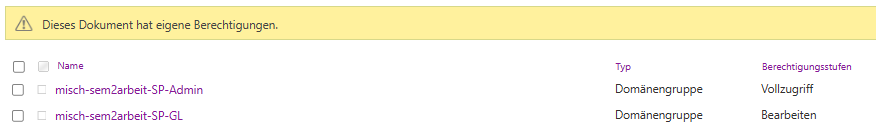
*Berechtigungen auf einem Newsbeitrag (Nur für die Rolle GL ersichtlich)*


Hier haben wir einige Beispiele, welche ich mit zwei Benutzern getestet habe. 

**Benutzer Daniel Musterhans** -> Rollen: MA, SB, SP

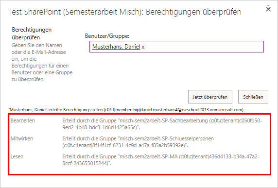
*Berechtigungen auf der Website*

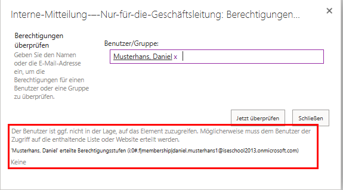
*Berechtigungen auf Newsbeitrag "Interne Mitteilung – Nur für die Geschäftsleitung"* 
<br>

**Benutzer Daniel Mustermann** -> Rollen: GL, MA

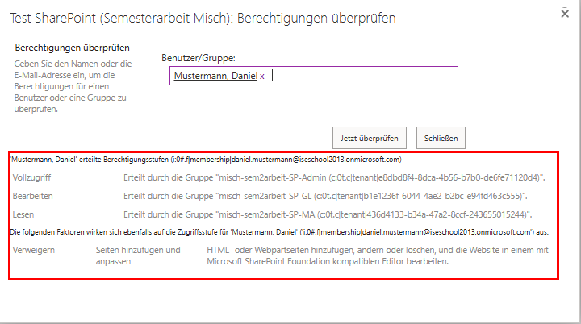
*Berechtigungen auf der Website*

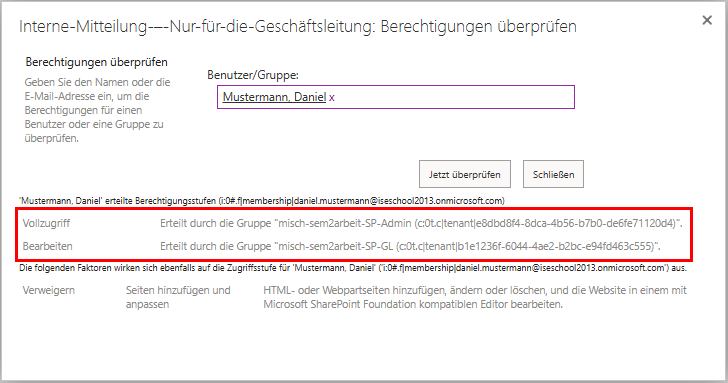
*Berechtigungen auf Newsbeitrag "Interne Mitteilung – Nur für die Geschäftsleitung"* 


### Entra ID

Über das Entra-ID (Ehemals Azure AD), läuft die gesammte User und Gruppenverwaltung. 

Mit hilfe von den beiden Scripts, erstellen wir einen Benutzer, fügen diesen die Lizenzgruppe hinzu und auch anhand seiner Rollen, in die jeweilige SharePoint Gruppe. 

Mit dem ersten Script erstellen wir den Benutzer mit allen Daten.

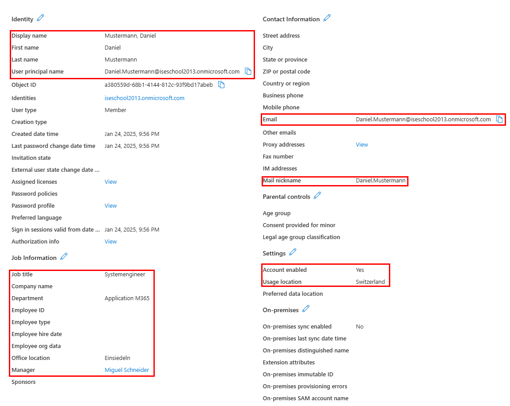
*Benutzereigenschaften* 

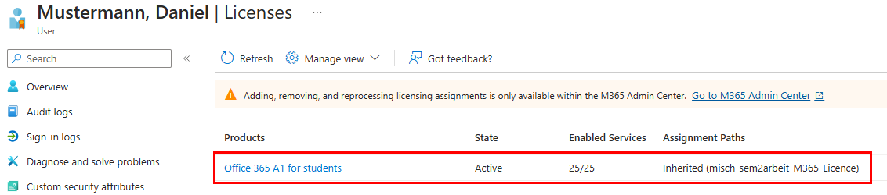
*Lizenzzuweisung via Gruppe* 

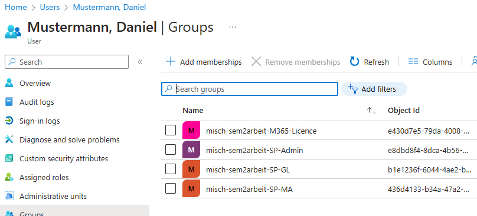
*Gruppen des Benutzers*

